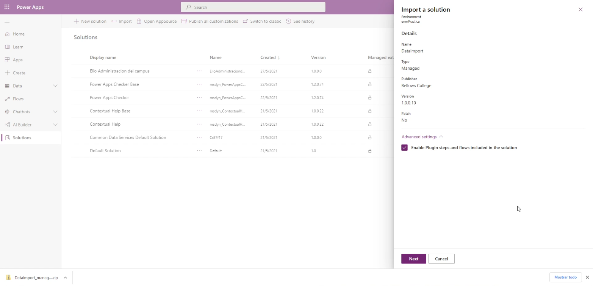

Module 0: Course introduction
=================================

## Lab: Validate lab environment

## Exercise 1 – Setup

### Task 1 - Acquire your Power Platform trial tenant

### Task \#2 – Create environment

# Exercise \#2: Provision a Power Apps portal

## Task \#1: Create Power Apps portal

# Module 2: Introduction to Microsoft Dataverse

## Lab: Data Modeling

# Exercise \#1: Create Solution

## Task \#1: Create Solution and Publisher

# Exercise \#2: Add Existing and Create New Tables

## Task \#1: Add Existing Table

## Task #2: Create Building Table

## Task #3: Create Visit Table and Columns

Create Visit table:

Created  Scheduled Start,  Scheduled End, Actual Start, Actual End and Code columns:

# Exercise \#3: Create Relationships

## Task #1: Create Relationships

Create Visit to Contact relationship:

Create Visit to Building relationship:

Saving table:

Published all customizations:

# Exercise \#4: Import Data

## Task #1: Import solution

Download  the **DataImport_managed.zip**:

## Task #2: Import Data  

## Task #3: Verify Data Import

# Module 3: Get started with Power Apps

## Lab: How to build a canvas app, Part 1

### continurá                        ...                             to be continued
